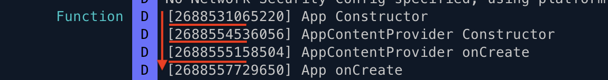
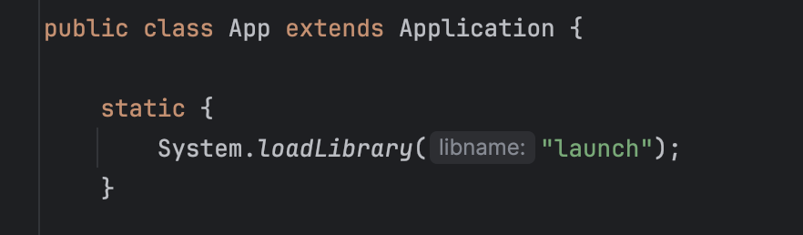
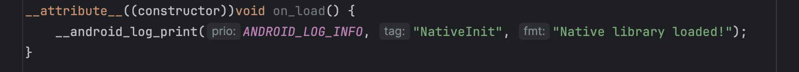

Introduction
============
Android system comprises of 4 major components. Activity, Service, Content Provider & Receivers. 
Content Providers are called ahead of the three components and even ahead of the Application's onCreate method.
This was purposefully designed to allow the app to prepare data before its available of the remaining components. This behaviour is documented here,
<a href="https://developer.android.com/reference/android/app/Application#onCreate()">Application onCreate</a>

Next is the application class itself. This is the class Android instantiates before calling any of the lifecycle methods inside 
an activity or content provider. Within this class I have added two methods
1. Constructor - Called when class is instantiated
2. onCreate - Called by the Android system during app launch
      
In each of these methods, I have called one function (Function.Call). This function will be responsible for logging the class name of the caller along with the timestamp of the call

There is an interesting case where broadcast receiver with LOCKED_BOOT_COMPLETED intent is called before any of the these components
(even before content provider). This receiver listens to LOCKED_BOOT_COMPLETED intent. The system fires this intent when device is booted/rebooted and user hasn't entered his pin code yet.

The intent is for apps to run initialization code before the file system is decrypted and becomes ready for use
<a href="https://developer.android.com/privacy-and-security/direct-boot">Direct Boot</a>

This allows us to call our function at the very early stage of device boot process:) However, at this stage, we don't have access to adb to log the timestamp of our function all. 
Hence, I have to write timestamp information into a file (log.txt). We can inspect this file and compare the stamp with other timestamp calls logged on ADB

Methodology
===========
Prepare a function that logs timestamp and class/method name of the caller to ADB. Call this function from different application components 
(Activity, Content provider, Application class, etc). This allows us to compare which of the functions was called first

So, in summary here is the timeline of events. i.e the order of function calls

Case -1
1. Application class constructor
2. Content provider class constructor
3. Content provider onCreate
4. Application class onCreate method

Case-2
1. BootAwareReceiver constructor
2. BootAwareReceiver onReceive method
3. Application class constructor

Alternative Method
==================

There is also the option of declaring a native function that can be executed whenever its loaded for the very first time. This can be achieved by loading the native library statically in the Application's class. See below

Then proceed to write this function in C 

 